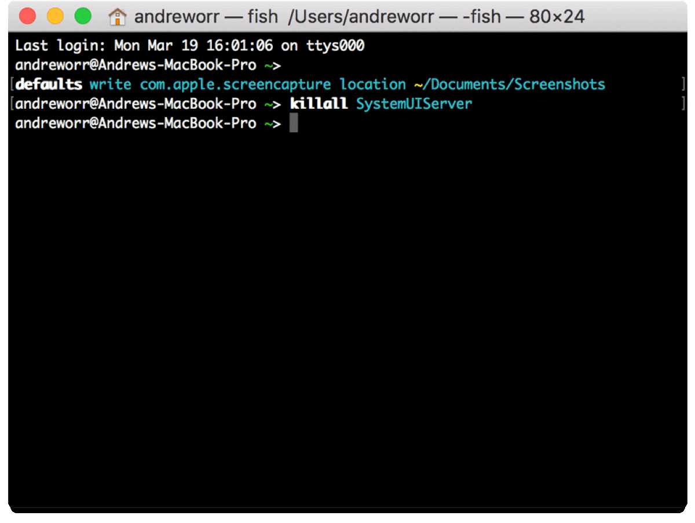

## ABB Communication

The ABB communication library is a collection of [python](https://www.python.org/doc/essays/blurb/) functions that makes communication between the ABB robot controller and your computer possible. While ABB provides its own software (RobotStudio) that allows you connect to the robot controller, change settings, send instructions, and also receive feedback, a python-based means of communication is much a easier to learn and implement in design projects, especially because we can execute python code directly from Rhino and Grasshopper.

## Installation

To get started, you will need to install some software:

- **Rhino**: 3D modeling and visualization
- **Anaconda**: everything you need to run python on your computer
- **Compas**: a python library (i.e. pre-written, callable functions, classes, etc.) geared towards those using python for architectural research. 
- **CompasFab**: a python library that extends Compas to include more functionality specific to robotic fabrication. 
- **ABB communication library**: A python library that enables communication between the robots and your computer without relying upon ABB's proprietary *RobotStudio* application. 

### 1. Rhino
_This documentation has been developed using Rhino 6. Older or newer versions of Rhino may work but have not yet been tested._

To install Rhino, follow the instructions on the Princeton SoA website:

- [**Windows**](https://archcomp.princeton.edu/software/install-rhino/install-rhino-6/)
- [**Mac**](https://archcomp.princeton.edu/software/install-rhino/install-rhino-6-mac/)

A license for Rhino can be obtained through the SoA using McNeel's [Zoo server](https://wiki.mcneel.com/zoo/home). this method requires you to be connected to Princeton's [Eduroam](https://csguide.cs.princeton.edu/access/wireless#:~:text=For%20Princeton%20users%2C%20your%20login,Tool%20to%20install%20the%20certificate) wifi network. If you would like to use Rhino while off campus, you will need to connect via VPN. 

To setup a VPN:

1. Download the appropriate VPN software for your computer [here](https://vpn.princeton.edu/global-protect/getsoftwarepage.esp). 
2. Follow the instructions found on [this](https://princeton.service-now.com/service?sys_id=KB0012373&id=kb_article) page under the section *Starting and disconnecting from GlobalProtect on your computer*.  
3. Now launch Rhino. Once Rhino is running, you can disconnect from the server. However, you must be connected to the VPN if you want to open a new Rhino window.


### 2. Anaconda

1. Download Anaconda [here](https://www.anaconda.com/products/individual).
	- **Windows**: choose the version that matches your operating system. If unsure which version of Windows  you have, go to *Start button > Settings > System > About* <br>

	- **Mac**: only one version exists
2. Run the Anaconda installer and choose the default settings:
    1. Install for: "just me"
    2. Destination Folder: this can be wherever, but go with the default if unsure.
    3. Advance options: none 
    4. Last page: uncheck both boxes unless you want those pages to open in your browser.

### 3. Compas and CompasFab

One of the python-related tools that Anaconda installs is the Anaconda prompt. This is a special command line that allows you to perform certain actions such as creating a code environments and downloading/installing code libraries. If you want to read more about why developers use the command line, check out [this article](https://www.digitalcitizen.life/what-is-cmd).

To install Compas and CompasFab:

1. Open Anaconda Prompt as an administrator
    - **Windows**: type anaconda prompt in the windows search bar <br/>
      <br/>
    - **Mac**: Open the Terminal app (comes with every installation of OSX. You do not need to download or install it). <br/>
      <br/>
2. In Anaconda Prompt/Terminal type or copy and paste the following commands into the command line. Press *enter* or *return* to execute a command.

We will use *your\_env\_name* as a placeholder for the name of the conda environment you are working in. 

1. Add the [conda-forge](https://conda-forge.org/#about) channel (not necessary but recommended by the Compas developers):

	```
	conda config --add channels conda-forge
	```

2. Create a new python [environment](https://docs.conda.io/projects/conda/en/latest/user-guide/concepts/environments.html) (not necessary but recommended if you are starting a new project):

	```
	conda create your_env_name
	``` 
	Alternatively, activate an existing environment that you would like to install Compas into: 	
	
	```
	conda activate your_env_name
	```

2. Install a version of Compas that we know is compatible with the ABB communication library and the Grasshopper playground file:

	```
	conda install compas=1.0.0
	```
	
	 Say *yes* if prompted during the installation. This can take a few minutes.

3. Install a compatible version of CompasFab:

	```
	conda install compas_fab=0.16.0
	```

4. Check that both were installed successfully with `conda list`. Look for compas and compas_fab in the long list of packages and double-check that the version numbers match those that you entered above. 

5. Rhino needs to be told where these libraries are. This is an important and often-forgotten step! Compas has a function that automates this process with a simple command. *You will need to be running Anaconda Prompt as an administrator for it to work.*

	```
	python -m compas_rhino.install
	python -m compas_fab.rhino.install
	```
6. Finally, make sure that the installation was successful by importing the libraries in a simple python program: 

	```
	python
	>> import compas
	>> import compas_fab
	```

	Use `exit()` to end the python session and return to the the Anaconda prompt.

If you don't see any errors, Compas and CompasFab are working. You should do the same test in a Grasshopper python component to see if they have been properly connected to Rhino. If they are importable in the Anaconda Prompt but not in Rhino, it's possible you need to revisit step 6.  
    
### 4. ABB communication 

While Compas and CompasFab are available to download and install using only conda commands, the ABB communication library must be cloned from GitHub and then installed in a similar way. 

You can use the command line to clone the repository or your favorite desktop application, such as the [Github app](https://desktop.github.com/). 

```
cd path/to/your_repos
git clone https://github.com/createchaos/abb_communication.git
pip install -e .
python -m compas_rhino.install -p abb_communication
```
Tip: don't forget the dot at the end of the `pip install -e .` command! 
  
#### 5. ROS-powered visualization

See the [CompasFab documentation](https://gramaziokohler.github.io/compas_fab/latest/backends/ros.html) regarding using ROS backends. You will need to install Docker. You will also need a Docker *compose.yaml* file to match the robot setup you would like to visualize. These are found in the /docker directory of this repository. 

## Operation

To connect to a robot:

1. Ping the robot IP address from your computer to ensure it can connect. For the small ABB 120 robots this is:
	-  192.168.0.102 for the robot with serial number ending in 286
	-  192.168.0.103 for the robot with serial number ending in 386
2. From robot flex pendant, select the *Production Window*.
3. Engage the deadman switch by pressing it half-way down.
3. Press *PP to main*. The program pointer (PP) will relocate to line 8. 
4. Press the play button on the pendant. 
5. Open the Grasshopper playground file included in this repository (in the /gh directory).
6. In Grasshopper, click these buttons in the following order:
	-  **Init**. Be sure you have selected the correct IP address for your robot.
	-  **Robot on**. Wait for the "ip address connected" message on the flex pendant. 
	-  **Update settings**. This sets the work object, tool, robot speed, etc. 
6. Now you can send commands to the robot from a Grasshopper file. If you made it this far, congratulations -- you are a genius!
